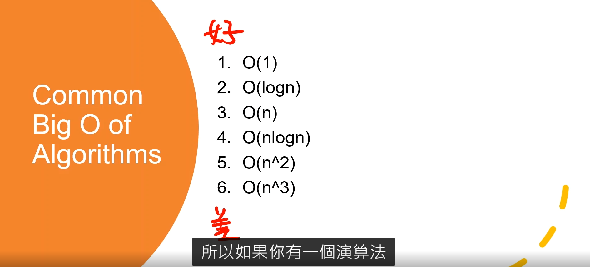
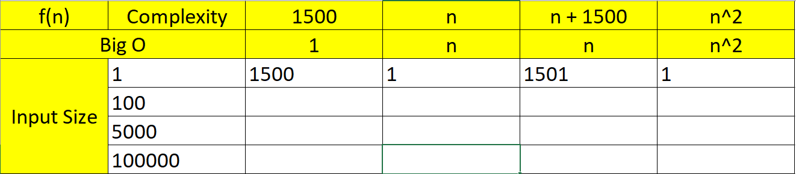

Big O Notation

1. Big O Ntation is a tool that describe the limiting behavior of a function when the argument tends of a function when the argument tends towards a particular value or infinity.
2. Big O Ntation has a "worst case scenario", which means it shows the general trends of complexity when the size of inputs is extremely large.

Calculating Big O value

1. Constant doesn't matter
2. Small Terms don't matter
3. Logarithm Base doesn't matter

* Constant 常數
* vaviable 變數

Example 1

* Given an algorithm that has time complexity f(n) = 2n, what's the big , of this algorithm?
* Q 👀️   f(n) = n

Example 2

* Given an algorithm that has time complexity f(n) = 13n^3 + 6n + 7,  what's the big O of this algorithm?
* Q 👀️ f(n) = n^3

Example3

* Given an algorithm that has time complexity f(n) = 4 log2 n, what's the big O of this algorithm?
* Q 👀️ f(n) = log n

!

