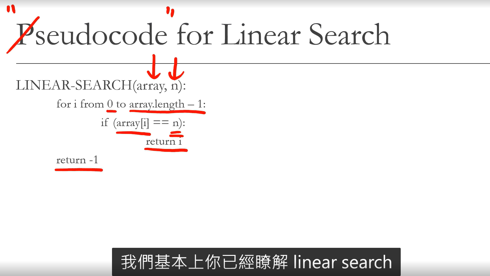

# List of Algorithms

## Linear Search (Sequental Search)

It's an slorithm that sequentially checks each element of the list until a match is found or the whole list has been searched.

Probably the easily algorithm we will learn in this course.

In our codeing practice, we will try      to find a number inside an array. If the number could be found, then return the index. If not, then return -1.

> 在一個 array 找尋存在在第幾格的意思

Pseudocode for Linear Search ( Pseudocode => p 不發音 意思是 虛擬代碼 )

>'

總結 :

> Overview of Linear Search

> Woret Case Performance: O(n)

> Best Case Performance : O(1)

> Average performance O(n.2)

## Binary Search :

> 簡單來說就是 一值 切兩半 篩選 值到 找到要的參數

1. Binary search is a search algorithm that finds the position of a target value within a sorted array
2. More efficient then linear search, but only works with sorted data set.
3. In our coding praction, we will have a sorted array, and one number we want to find inside this sorted array, If the number could be found, then return the index.If not , then return -1

## Counter

## Pointer

## Sliding Window

## Recursion
