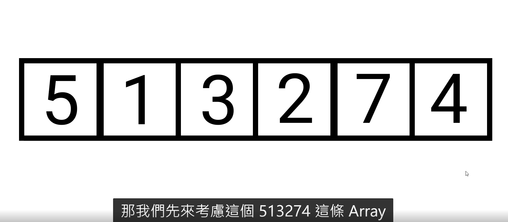
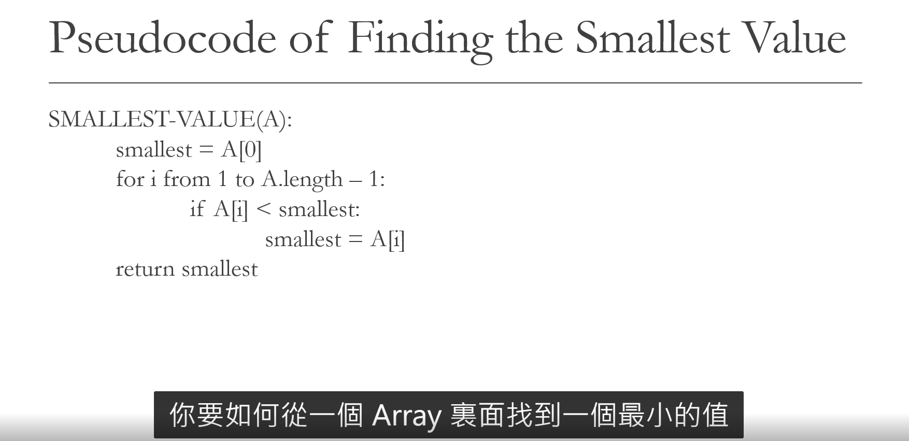
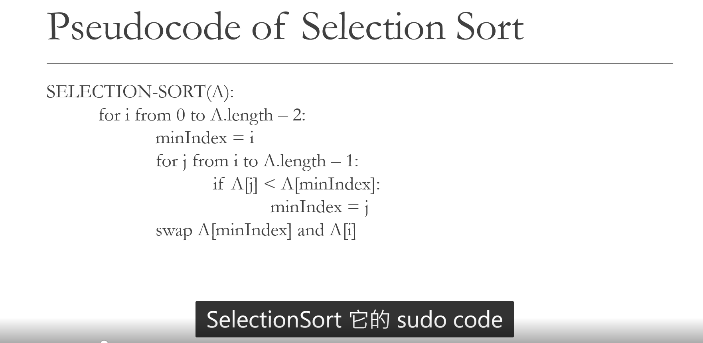
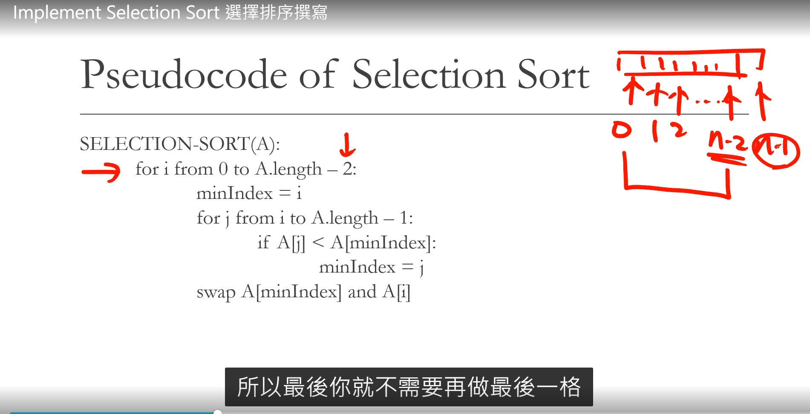

Selection Sort

1. The principle of selection sort is - select the smallest value in unsorted array, and then swap it with the left most value in the unsorted array.
2. Wait... how do we  "select" the smallest value inside an unsorted array? We'll see.
3. Selection sort is the last  "not so efficient" sorting algorithm we will learn in this course.

