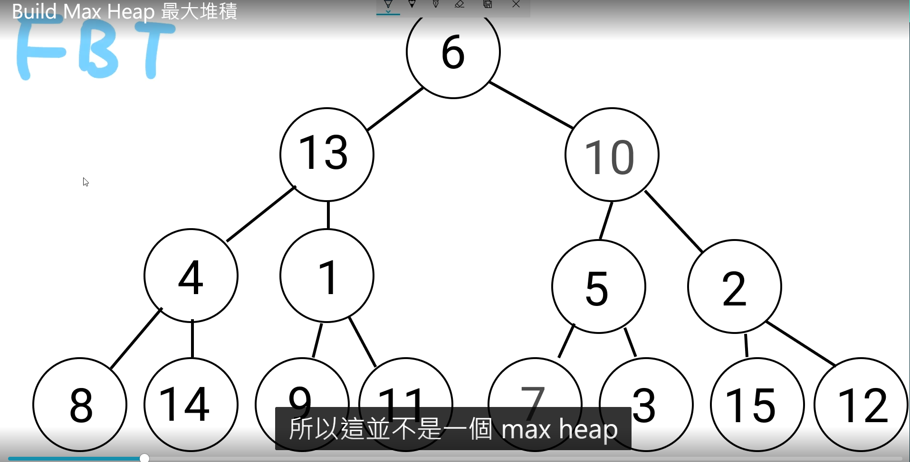
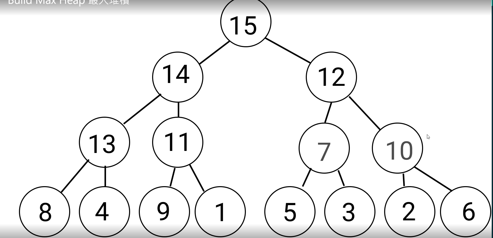
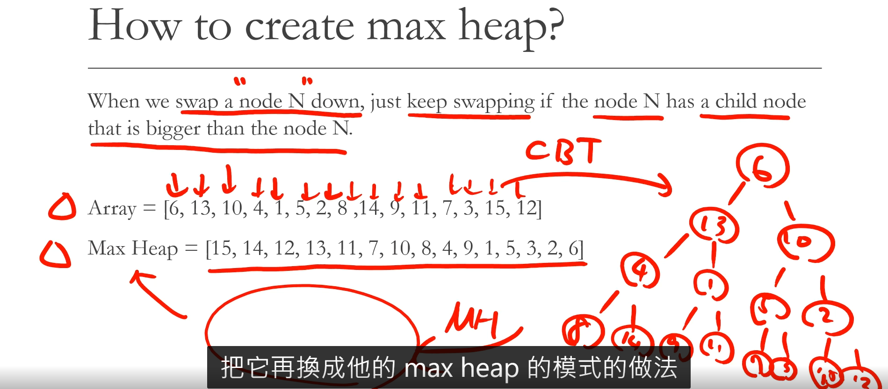
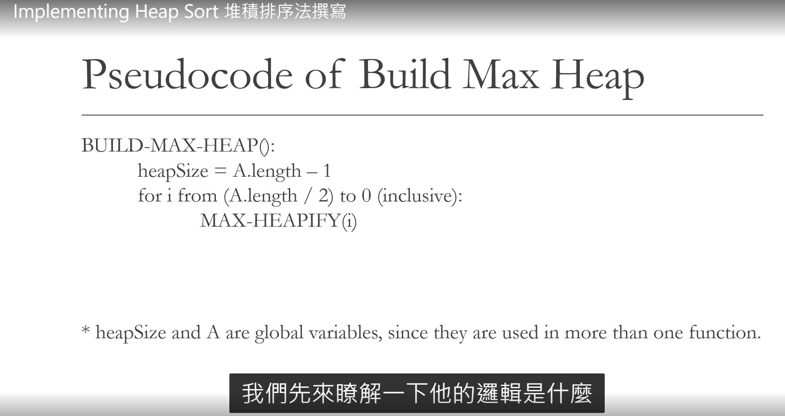
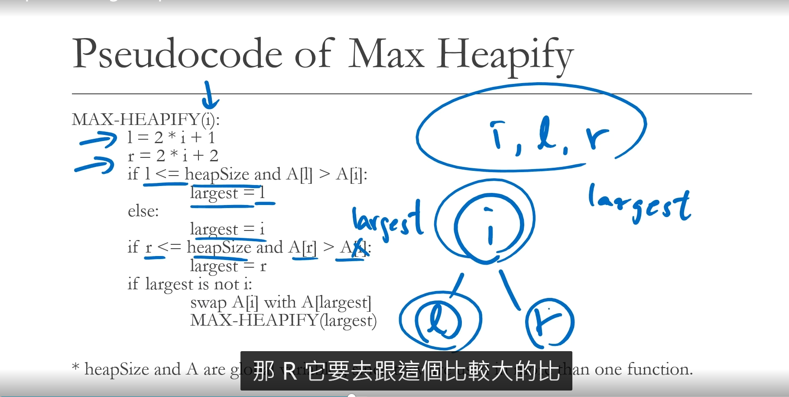
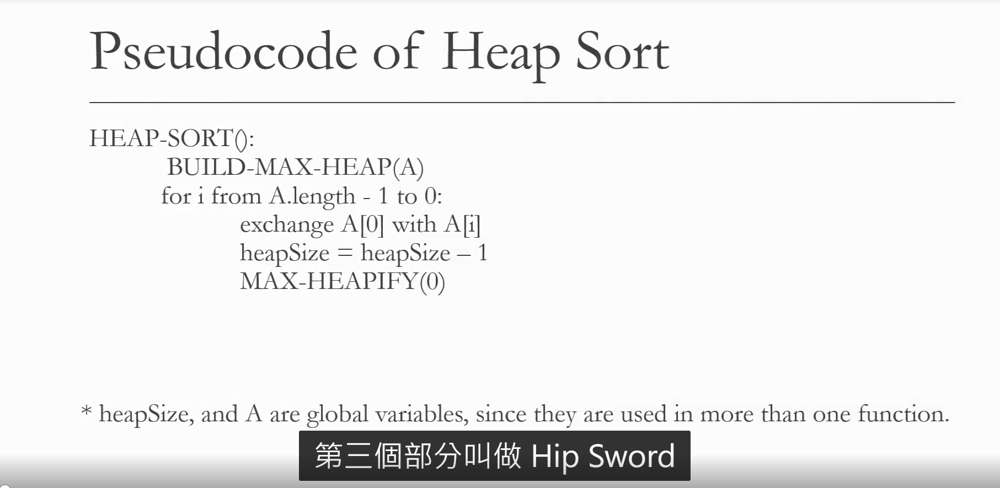

# Heap Sort

1. Heap sort uses Max Heap to sort.
2. In order to understsnd our next sorting algorithm, Heap Sort , you must first understand what a "max heap" is. Also, we need to know how max heap algorithm works.

## How to create max heap?

When we swap a node N down, just keep swapping if the node N has a child node that is bigger than the node N.

Array = [6,13,10,4,1,5,2,8,14,9,11,7,3,15,12]

Max Heap = [15,14,23,23,11,7,10,8,4,9,1,5,3,2,6]

!
