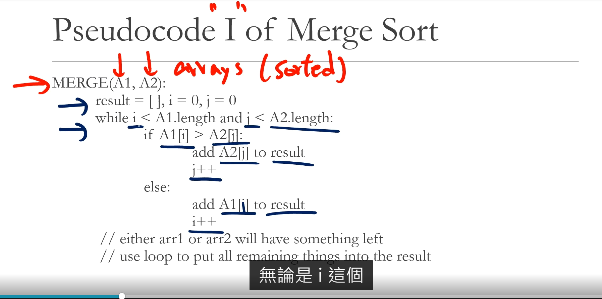
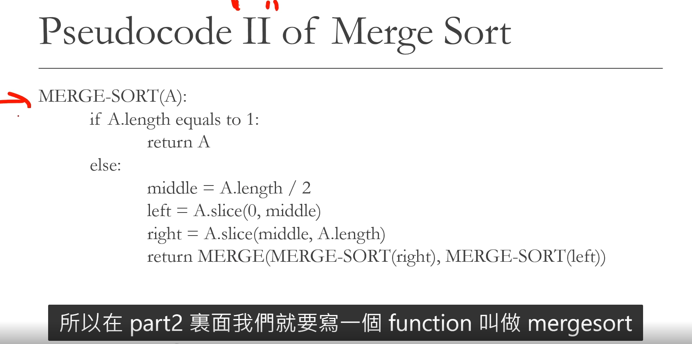

Merge Sort  合併排序法

1. The principe of merge sort id quite simple. Take advantage of the fact that combining twosorted arrays has O(n) time complexity, using the pointer skill.
2. This sorting algorithm is a classic example of "divide and conquer".

!

