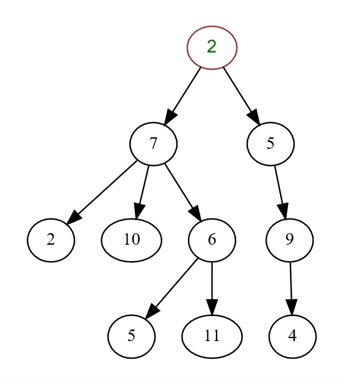

Tree ( Data Structure )

1. In computer science, a tree is a widely used ( abstract data type  : 抽象資料類型) that simulates a hierarchical tree structure, with a root value and subtrees of children with a parent node, represented as a set of linked nodes.
2. A tree should have only one root.
3. Another definition of tree is "tree is acyclic graph".

## Binary Tree

### Binary Tree

mean each node has at most two children,which are refrred to as the left child and the right childern, which are referred to as the left child and the right child.

### Complete Binary Tree

means an "almost-full" binary tree, the right most nodes of the bottom might be missing.

### Full Binary Tree

means a binary tree in which all leaf nodes have the same depth.

### Max Heap

means a complete binary tree where the largest node is always the at root for any sub-trees.

