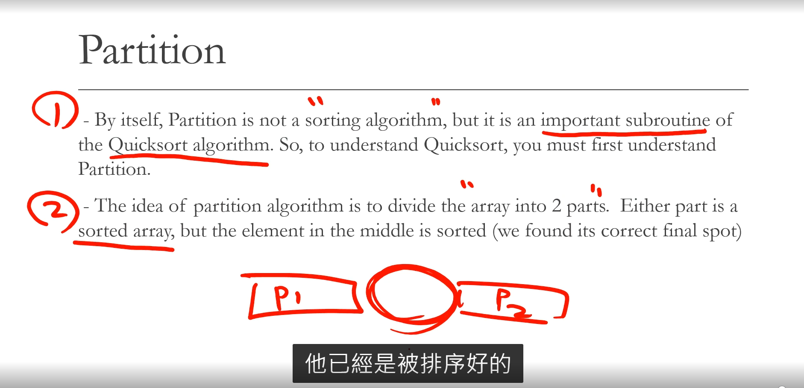
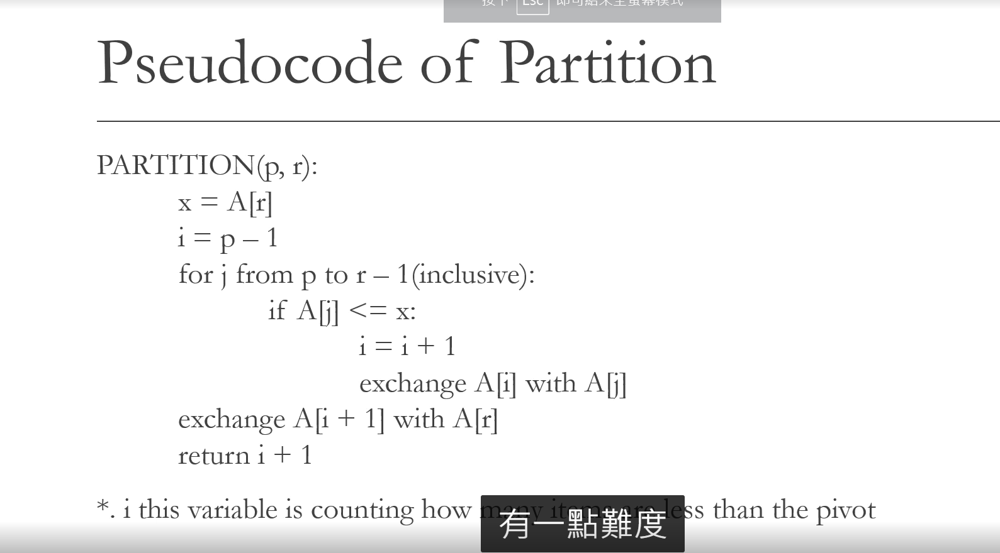
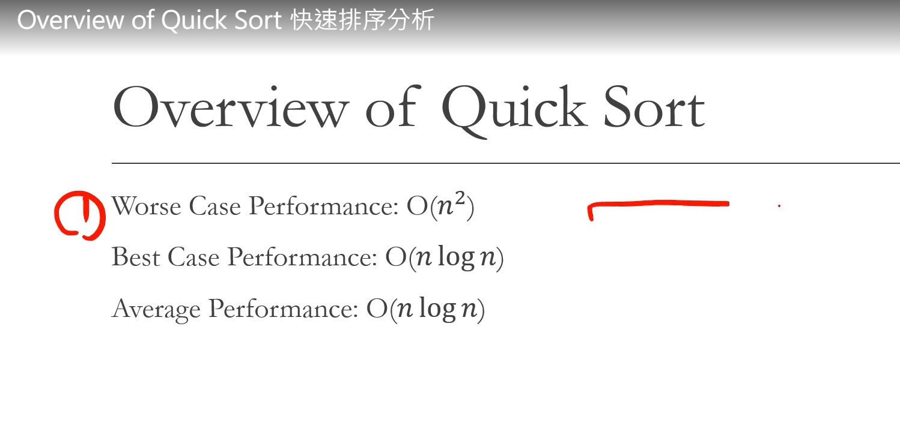

# Quick Sort

1. As you know from its name, quick sort is quick.
2. Developed by British computer scientist Tony Hoare in 1959 and published in 1961, it is still a commonly used algorithm for sorting.

